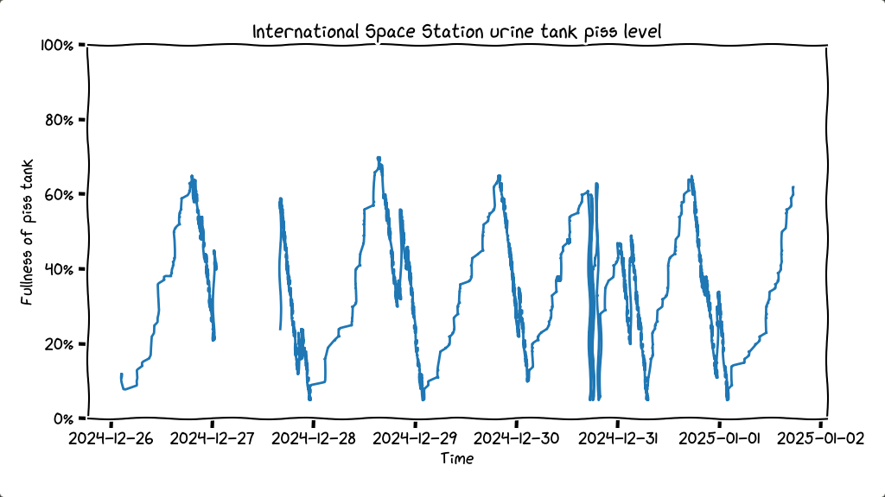
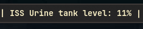
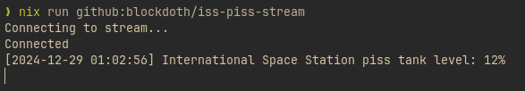

# ISS Piss Tank Stream Monitor
---

Ever wanted to know the contents of the piss tank of the international space station? Now you do!

# Features
- Real-Time Piss Level Monitoring
- Logging
- Minimal mode, for embedding into taskbars
- XKCD style graph
  
# Installation
### Using Nix
Specify it a as a flake input, (pick a commit, its likely I will break things)
```
iss-piss-stream.url = "github:blockdoth/iss-piss-stream/{OPTIONAL-COMMIT_HASH}}";
```

### Using python 
```
git clone git@github.com:blockdoth/iss-piss-stream.git
some venv thing? idk I dont use them
pip install lightstreamer-client
```
# Usage


Run the logger script using:
```
pyton main.py [-l] [-o LOG_FILE_PATH] [-p]
```

Options:
- `-l, --log` \
    Enable logging to file. Default: False

- `-o, --log_file_path` \
    Specify the path for the log file. Default: pisslog.csv.

- `-p, --percentage_only` \
    Print only the percentage values to the console without timestamps or logging. Usefull to when you want to add the result into a taskbar for example



- Or use `nix run` to run it without installing
```
nix run github:blockdoth/iss-piss-stream 
```



Run the graphing script using:
```
pyton graph.py [-f LOG_FILE_PATH] [-o PLOT_OUT_PATH] [-p] [-s] 
```

Options:
- `-f, --log_file_path` \
    Specify the path for the log file. Default: pisslog.csv.
- `-0, --plot_out_path` \
    Specify the path for plot image. Default: pisslog.png
- `-p, --plot` \
    Enable showing the plot. Default: True
- `-s, --save_plot` \
    Enable saving the plot as an image. Default: False


- Or use `nix run` to run it without installing
```
nix run github:blockdoth/iss-piss-stream#iss-piss-graph
```

